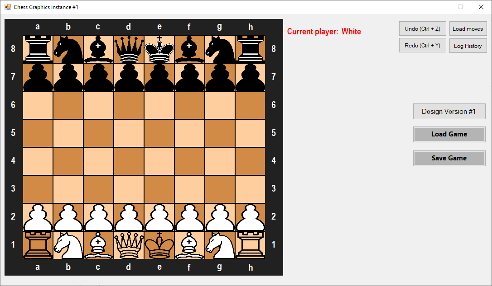
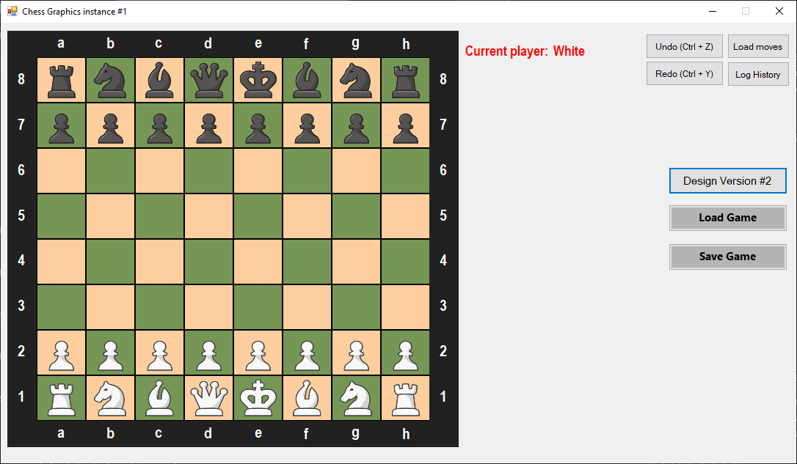

# Chess Project

Chess Game developed as part of Magshimim's second year (Israel's National Cyber Education Program)

## Features

* Customizable design
* offline PvP (possibly online mode in the future)
* Save a game to a `.chess` file (in-game button or Ctrl+S)
* Load a game by either opening a `.chess` file or by loading it from in-game
* Standalone button to load moves one by one
* Button to get the game's history
* Undo/Redo moves (in-game buttons or Ctrl+Z/Ctrl+Y)
* All special moves supported:
    * En Passant
    * Castling
    * Pawn Promotion
* All basic game rules are applied
## Getting Started

### Installation

* Download the [Stable](https://github.com/itssigron/Magshimim-GifMaker/releases/tag/v1.0.0) release
* Follow all installation steps
* Enjoy :)
## File Structure

* `ChessEngine` - The game's engine (contains all game's logic and built in C++ using named pipes)
    * `Board.h & Board.cpp` - Represents the game's Board.
    * `Player.h & Player.cpp` - Represent a player in the game.
    * `Piece.h & Piece.cpp` - Abstract class represents one of the following:
        * `Pawn.h & Pawn.cpp`
        * `Knight.h & Knight.cpp`
        * `Bishop.h & Bishop.cpp`
        * `Rook.h & Rook.cpp`
        * `Queen.h & Queen.cpp`
        * `King.h & King.cpp`
        * `EmptyPiece.h & EmptyPiece.cpp` - Only used to determine if its an empty square. 
        ### Each piece has a method called `validateMove` to check if a move to a specific destination can be considered valid or not. 
    * `globalVars.h` - Contains global variables's declarations.
    * `Pipe.h` - Contains named pipe's main logic.
    * `Source.cpp` - Main's engine file  

* `ChessGraphics` - The game's GUI (contains all game's design and built in C# Windows forms app)
    * `Resources` - All game's resources (i.e images)
    * `Form1.cs & Form1.Designer.cs & Form1.resx` - The game's main GUI design
    * `GameHistory.cs & GameHistory.Designer.cs & GameHistory.resx` - A prompt to show the game's history to the user.

    * `LoadMovesPrompt.cs & LoadMovesPrompt.Designer.cs & LoadMovesPrompt.resx` - A prompt to allow the user to load a sequence of moves automatically.

    * `PawnPromotionPrompt.cs & PawnPromotionPrompt.Designer.cs & PawnPromotionPrompt.resx` - A prompt to let the user choose a promotion for his pawn.    
    * `Square.cs` - Represents a square in the board.
    * `Tests.cs` - Contains automated tests to check specific functionality.
    * `Pipe.cs` - Contains named pipe's main logic.
    * `Program.cs` - Main client's file.
## Support

If any problem occurs during the use of this program, feel free to open an issue.

## Authors

- [Harel Sigron](https://gitlab.com/itssigron)
- [Raz](https://gitlab.com/Razkoo)