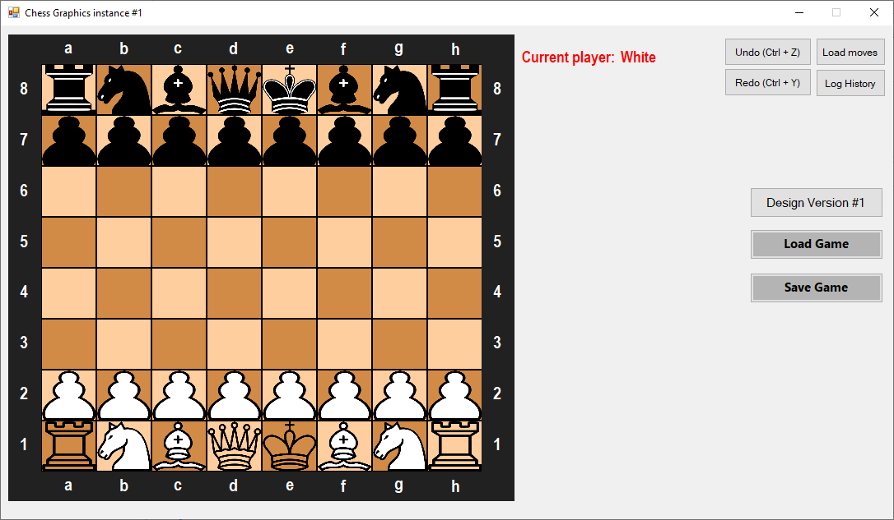
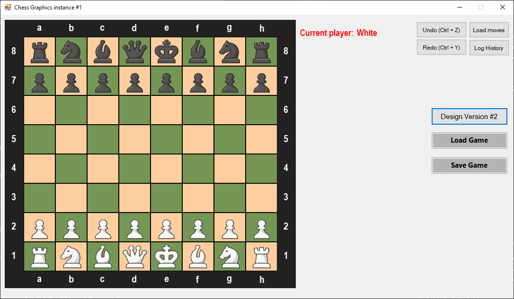

# Chess Project

Chess Game developed as part of Magshimim's second year (Israel's National Cyber Education Program)

## Features

* Customizable design
* Online and Offline PvP
* Online server is currently hosted in a vps, valid connection details can be found in ChessClient/ServerPipe.cs:13
* Online chat
* Discord RPC when playing the game
* Save a game to a `.chess` file (in-game button or Ctrl+S)
* Load a game by either opening a `.chess` file or by loading it from in-game
* Standalone button to load moves one by one
* Button to get the game's history
* Undo/Redo moves (in-game buttons or Ctrl+Z/Ctrl+Y)
* All special moves supported:
    * En Passant
    * Castling
    * Pawn Promotion
* All basic game rules are applied
## Getting Started

### Installation

* Download the [Latest](https://github.com/itssigron/Chess/releases/tag/v2.0.0) release
* Follow all installation steps
* Note - the online game mode is queue-based, meaning that a game is being set up to the first 2 players joining each time. So if you want to play with your friend, you will probably want to enter around the same time so no one else will.
* The game is also currently able to run only 10 games at once, you may change that limit in ChessOnline/OnlinePipe.h:32
## File Structure

* `ChessOnline` - The game's server 
(for online game mode)
    * `Socket.h` - A socket server wrapper for `winsock2`.
    * `OnlinePipe.h` - The main bridge between the server and clients. it handles new connections and matchmake every 2 first players to connect.
    * `Source.cpp` - The main game logic (contains the functionality to handle games)  

* `ChessOffline` - The game's engine (contains all game's logic and built in C++ using named pipes)
    * `Board.h & Board.cpp` - Represents the game's Board.
    * `Player.h & Player.cpp` - Represent a player in the game.
    * `Piece.h & Piece.cpp` - Abstract class represents one of the following:
        * `Pawn.h & Pawn.cpp`
        * `Knight.h & Knight.cpp`
        * `Bishop.h & Bishop.cpp`
        * `Rook.h & Rook.cpp`
        * `Queen.h & Queen.cpp`
        * `King.h & King.cpp`
        * `EmptyPiece.h & EmptyPiece.cpp` - Only used to determine if its an empty square. 
        ### Each piece has a method called `validateMove` to check if a move to a specific destination can be considered valid or not. 
    * `globalVars.h` - Contains global variables's declarations.
    * `Pipe.h` - Contains named pipe's main logic.
    * `Source.cpp` - Main's engine file  

* `ChessClient` - The game's GUI (contains all game's design and built in C# Windows forms app)
    * `Resources` - All game's resources (i.e images)
    * `OfflineGameForm.cs` - The GUI for the offline game mode.
    * `OnlineGameForm.cs` - The GUI for the online game mode.
    * `GameHistory.cs` - A prompt to show the game's history to the user.
    * `LoadMovesPrompt.cs` - A prompt to allow the user to load a sequence of moves automatically.
    * `PawnPromotionPrompt.cs` - A prompt to let the user choose a promotion for his pawn.    
    * `Square.cs` - Represents a square in the board.
    * `Tests.cs` - Contains automated tests to check specific functionality.
    * `OfflinePipe.cs` - Contains named pipe's main logic for offline use.
    * `ServerPipe.cs` - Contains the online communication logic using sockets.
    * `Socket.cs` - A socket client wrapper for TcpClient used in `ServerPipe.cs`.
    * `Program.cs` - Main client's file.
## Support

If any problem occurs during the use of this program, feel free to open an issue.

## Authors

- [Harel Sigron](https://github.com/itssigron)
- [Raz](https://github.com/Razkoo)
